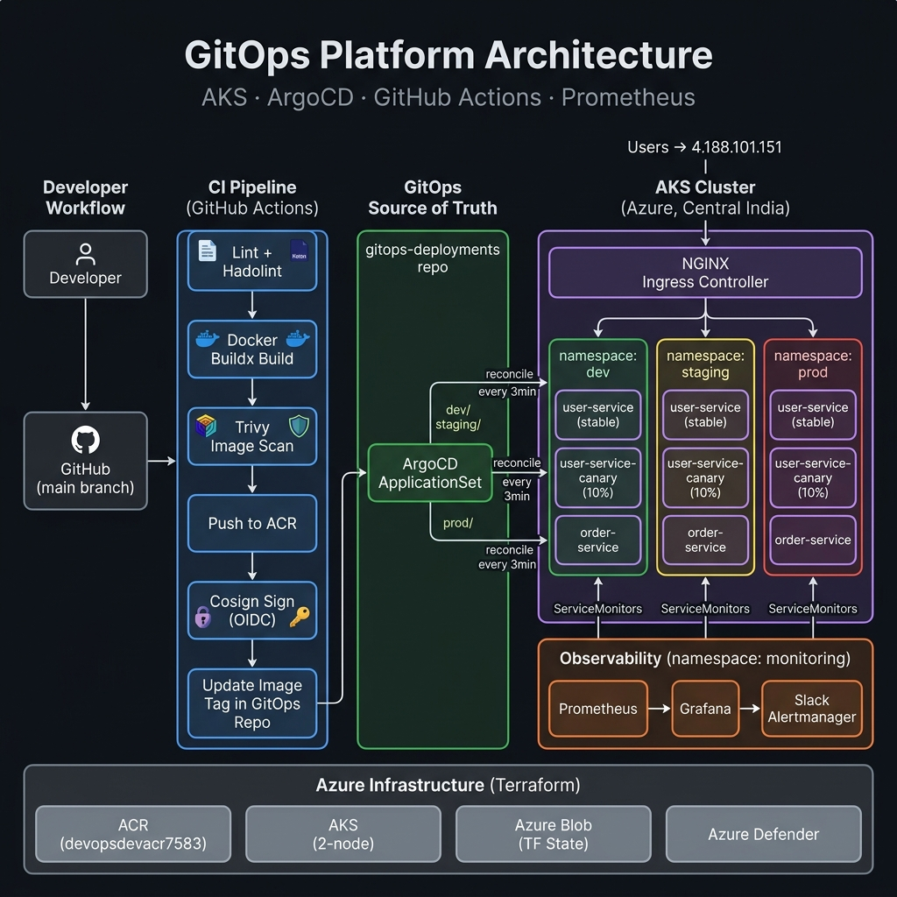
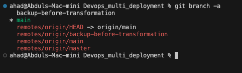
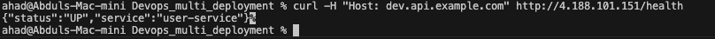
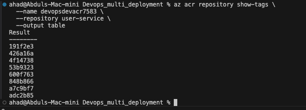

# 🚀 GitOps Platform — AKS · ArgoCD · GitHub Actions · Prometheus

[](https://github.com/siddiquiabdul007/Devops_multi_deployment/actions/workflows/deploy.yml)
[](LICENSE)
[](https://kubernetes.io)
[](https://argo-cd.readthedocs.io)
[](https://terraform.io)

A **production-grade GitOps platform** running on Azure Kubernetes Service (AKS). Two Node.js microservices are automatically built, scanned, signed, and deployed across three isolated environments (dev / staging / prod) entirely through GitOps — no `kubectl apply` in CI.

---

## 🏗️ Architecture



| Layer | Technology | Detail |
|-------|-----------|--------|
| **Source Control** | GitHub | Monorepo — services + IaC + K8s manifests |
| **CI Pipeline** | GitHub Actions | Lint → Build → Trivy scan → Push → Cosign sign |
| **GitOps Controller** | ArgoCD + ApplicationSet | Reconciles every 3 min; source of truth in [gitops-deployments](https://github.com/siddiquiabdul007/gitops-deployments) |
| **Container Runtime** | AKS 1.34 · 2× Standard_B2s_v2 | Central India region |
| **Registry** | Azure Container Registry (`devopsdevacr7583`) | Private, ACR-pull via Managed Identity |
| **Ingress** | NGINX Ingress Controller | LB IP: `4.188.101.151`; TLS via cert-manager |
| **Observability** | kube-prometheus-stack | Prometheus · Grafana · Alertmanager → Slack |
| **IaC** | Terraform | Remote state in Azure Blob; modular `/modules/aks`, `/modules/acr` |
| **Security** | Trivy + Cosign + Azure Defender | Image scanning + keyless signing + runtime protection |

---

## 🌍 Environments

Three fully isolated namespaces, each reconciled independently by ArgoCD:

| Environment | Namespace | Ingress Host | Image Tag Strategy |
|-------------|-----------|--------------|-------------------|
| **dev** | `dev` | `dev.api.example.com` | Every push to `main` |
| **staging** | `staging` | `staging.api.example.com` | Same tag, separate namespace |
| **prod** | `prod` | `prod.api.example.com` | Same tag, separate namespace |

Each environment runs:
- `user-service` (stable — 90% traffic)
- `user-service-canary` (10% traffic weight via NGINX canary annotation)
- `order-service`

---

## 🔁 CI/CD Flow

```
git push → GitHub Actions triggers
  ├── Lint (yamllint + hadolint)
  ├── Build (Docker Buildx with GHA cache)
  ├── Scan (Trivy — fail on CRITICAL/HIGH CVEs)
  ├── Push → ACR (devopsdevacr7583)
  └── Sign (Cosign keyless via OIDC — no long-lived keys)

ArgoCD polls gitops-deployments repo every 3 min
  ├── dev-microservices   → k8s/envs/dev/
  ├── staging-microservices → k8s/envs/staging/
  └── prod-microservices  → k8s/envs/prod/
```

> CI **never runs `kubectl`**. ArgoCD is the only actor that writes to the cluster.

---

## 🧩 Services

### `user-service` (`services/user-service/`)
Node.js REST API. Provides user data on `/users` and health check on `/health`.
- Port: `3001`
- Security: non-root, read-only filesystem, drop all capabilities

### `order-service` (`services/order-service/`)
Node.js REST API. Provides order data on `/orders`, calls `user-service` internally.
- Port: `3002`
- Security: same hardened profile as user-service

---

## 🏗️ Infrastructure (Terraform)

```
infra/terraform/
├── modules/
│   ├── aks/          # AKS cluster (OIDC + Workload Identity)
│   ├── acr/          # Azure Container Registry
│   └── networking/   # VNet, subnets
└── envs/
    ├── dev/          # Calls modules, state in Azure Blob
    └── prod/         # Same modules, separate state key
```

Remote state backend — Azure Blob Storage (`devopstfstate987654`).

### Bootstrap

```bash
# 1. Provision infrastructure
cd infra/terraform/envs/dev
terraform init   # pulls state from Azure Blob
terraform plan
terraform apply

# 2. Merge cluster credentials
az aks get-credentials \
  --resource-group devops-dev-rg \
  --name devops-dev-aks \
  --overwrite-existing

# 3. Install ArgoCD (server-side apply handles CRD size limit)
kubectl apply --server-side --force-conflicts -k k8s/argocd/

# 4. Apply ApplicationSet (creates all 3 apps)
kubectl apply -f k8s/argocd/appset.yaml

# 5. Install platform components
kubectl apply -k k8s/ingress/
kubectl apply -k k8s/cert-manager/
helm install prometheus prometheus-community/kube-prometheus-stack \
  --namespace monitoring --create-namespace
```

---

## 📊 Observability

| Component | Detail |
|-----------|--------|
| **Prometheus** | `kube-prometheus-stack` via Helm; scrapes all 3 namespaces |
| **ServiceMonitors** | One per environment (`dev`, `staging`, `prod`) |
| **PrometheusRules** | Custom `platform-alerts` + 30+ built-in rules |
| **Grafana** | SLO dashboard (ConfigMap: `grafana-slo-dashboard`) |
| **Alertmanager** | Routes to Slack (`AlertmanagerConfig`: `slack-alerts`) |

---

## 🔒 Security

- **Trivy** scans every image build; fails pipeline on `CRITICAL` or `HIGH` unfixed CVEs
- **Cosign** signs images after push using **keyless OIDC** (no stored signing keys)
- **Pod Security**: `runAsNonRoot`, `readOnlyRootFilesystem`, `capabilities: drop: [ALL]`
- **NetworkPolicies**: Default-deny-all; explicit allow per service
- **Azure Defender for Containers**: Enabled at subscription level
- **Workload Identity**: AKS uses OIDC + Federated Identity; no service principal passwords

---

## ⚖️ Reliability

| Mechanism | Config |
|-----------|--------|
| **HPA** | `minReplicas: 1 → maxReplicas: 5` at 70% CPU |
| **PodDisruptionBudget** | `minAvailable: 1` for both services |
| **VPA** | Installed in `Off` mode (recommendation only) |
| **TopologySpreadConstraints** | Spread across availability zones |
| **Canary Deployment** | 10% weight via `nginx.ingress.kubernetes.io/canary-weight: "10"` |
| **Rolling Updates** | `maxUnavailable: 0`, `maxSurge: 1` |

---

## 🧪 Smoke Tests

```bash
# Run k6 against the dev ingress IP
k6 run \
  --env TARGET_URL=http://4.188.101.151 \
  --env HOST_HEADER=dev.api.example.com \
  tests/smoke.js
```

**Last run results:**
```
✓ http_req_duration  p(99)=31.24ms  (threshold: <500ms)
✓ http_req_failed    rate=0.00%     (threshold: <1%)
✓ is status 200      153/153        100%
```

---

## 📸 Screenshots

### ArgoCD — All 3 Environments Synced & Healthy


### Kubernetes Pods — All Running


### k6 Smoke Test — Passed


---

## 📁 Repository Layout

```
Devops_multi_deployment/
├── .github/
│   └── workflows/
│       ├── deploy.yml          # Main CI/CD pipeline
│       └── terraform-pr.yml    # Terraform plan on PR
├── services/
│   ├── user-service/           # Node.js user API
│   └── order-service/          # Node.js order API
├── k8s/
│   ├── argocd/                 # ArgoCD install + ApplicationSet
│   ├── base/                   # Shared K8s manifests (Kustomize base)
│   ├── envs/
│   │   ├── dev/                # Dev overlay (ingress patch, ssl-redirect off)
│   │   ├── staging/            # Staging overlay
│   │   └── prod/               # Prod overlay
│   ├── ingress/                # NGINX Ingress Controller
│   └── cert-manager/           # cert-manager + ClusterIssuer
├── infra/terraform/
│   ├── modules/                # Reusable AKS, ACR, networking modules
│   └── envs/                   # dev + prod environment configs
├── monitoring/                 # PrometheusRules, AlertmanagerConfig, Grafana dashboards
├── tests/
│   └── smoke.js                # k6 smoke test
├── docs/
│   ├── architecture.png        # Architecture diagram
│   └── screenshots/            # Evidence: ArgoCD, k6, pods
├── RUNBOOK.md                  # Operational notes and known fixes
└── CONTRIBUTING.md             # PR + branch protection guidelines
```

---

## 🛠️ Operational Notes

See **[RUNBOOK.md](RUNBOOK.md)** for documented fixes and operational procedures including:
- AKS OIDC Terraform configuration
- ArgoCD CRD server-side apply workaround
- cert-manager webhook cleanup
- Node scaling rationale

---

## 👨‍💻 Author

**Abdul Ahad** — [GitHub](https://github.com/siddiquiabdul007)

---

## ⭐ Support

If this project was useful, give it a ⭐ — it helps others find it.
