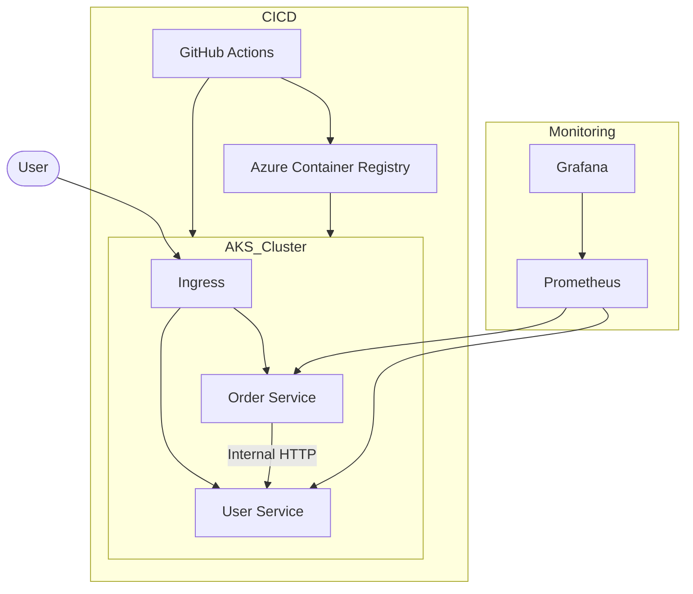

# 🚀 DevOps Multicloud Platform

## 📌 Overview

A production-grade microservices system demonstrating:

* ☸️ Kubernetes deployment (Azure AKS)
* 🔁 CI/CD automation (GitHub Actions)
* 🐳 Containerization (Docker + ACR)
* 📊 Observability (Prometheus + Grafana)
* 🧱 Infrastructure as Code (Terraform-ready structure)

Currently deployed on **Azure Kubernetes Service (AKS)** with design considerations for **multi-cloud expansion**.

---

## 🏗️ Architecture

*For the full diagram, see `architecture.drawio`. Quick reference below:*



---

## 🧩 Components

* **user-service**
  Node.js service providing user data.

* **order-service**
  Node.js service providing order data and internally calling `user-service`.

* **Infrastructure**
  Terraform scripts (`infra/terraform/`) to provision:

  * AKS cluster
  * Azure Container Registry (ACR)
  * Resource groups

* **CI/CD Pipeline**
  GitHub Actions workflow:

  * Builds Docker images
  * Tags with commit SHA
  * Pushes to ACR
  * Deploys to AKS

* **Monitoring Stack**
  Kube-Prometheus stack deployed via Helm:

  * Prometheus (metrics collection)
  * Grafana (visualization dashboards)

---

## 🚀 How to Run

### 1️⃣ Provision Infrastructure

```bash
cd infra/terraform/envs/dev
terraform init
terraform plan
terraform apply
```

---

### 2️⃣ Configure kubectl

```bash
az aks get-credentials --resource-group multicloud-dev-rg --name multicloud-dev-aks
```

---

### 3️⃣ Deploy Application

```bash
kubectl apply -f k8s/base/
```

---

### 4️⃣ Install Monitoring

```bash
cd monitoring
chmod +x install-monitoring.sh
./install-monitoring.sh
```

---

## ⚖️ Scaling Strategy

### 🔹 Horizontal Pod Autoscaling (HPA)

* Scales between **2 → 5 replicas**
* Triggered at **70% CPU utilization**

### 🔹 Node Scaling

* Currently uses fixed node count
* Can be upgraded to cluster autoscaler via Terraform node pools

---

## 🔁 CI/CD Flow

1. Developer pushes code to `main`
2. GitHub Actions pipeline triggers
3. Code is built and dependencies installed
4. Docker images are created and tagged (SHA + latest)
5. Images pushed to Azure Container Registry (ACR)
6. Kubernetes manifests updated and applied
7. Deployment rollout monitored
8. Automatic rollback on failure

---

## 💰 Cost Optimization

* AKS cluster stopped when not in use:

```bash
az aks stop --name <cluster-name> --resource-group <resource-group>
```

* LoadBalancer services removed after testing

---

## 🧠 Key Learnings

* Built end-to-end CI/CD pipeline
* Deployed microservices on Kubernetes
* Implemented autoscaling with HPA
* Integrated observability using Prometheus & Grafana
* Managed Azure cloud resources efficiently
* Practiced cost-aware DevOps workflows

---

## 🚀 Future Improvements

* Terraform full infrastructure automation
* Multi-environment setup (dev/staging/prod)
* Ingress + custom domain + HTTPS
* Canary / Blue-Green deployments
* Alerting & incident response setup

---

## 👨‍💻 Author

**Abdul Ahad**

---

## ⭐ Support

If you found this project useful, consider giving it a ⭐ on GitHub!
