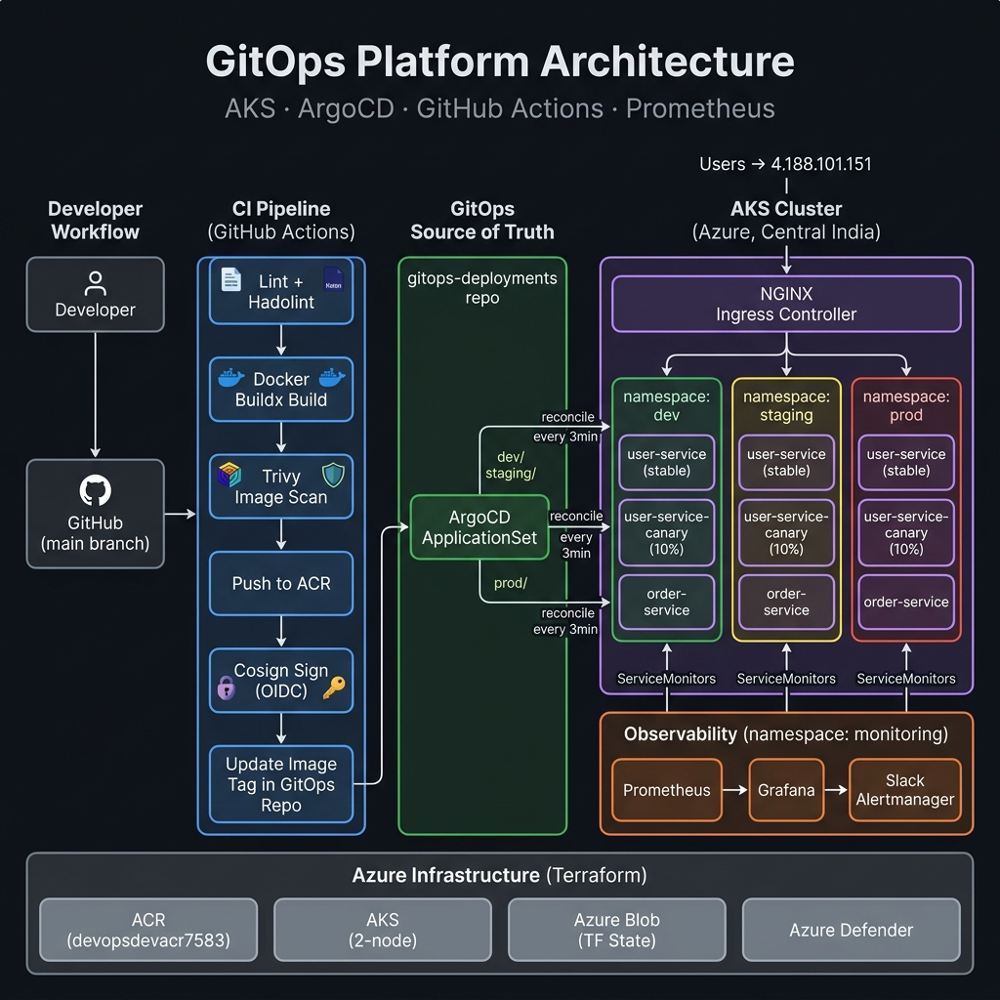
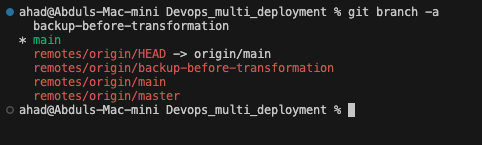
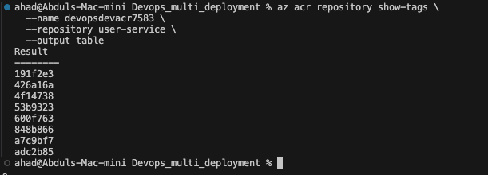
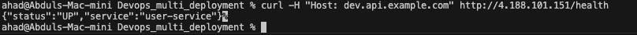

# 🚀 GitOps Platform — AKS · ArgoCD · GitHub Actions · Prometheus

[](https://github.com/siddiquiabdul007/Devops_multi_deployment/actions/workflows/deploy.yml)
[](https://github.com/siddiquiabdul007/Devops_multi_deployment/commits/main)
[](https://github.com/siddiquiabdul007/Devops_multi_deployment)
[](LICENSE)
[](https://kubernetes.io)
[](https://argo-cd.readthedocs.io)
[](https://terraform.io)

A **production-grade GitOps platform** running on Azure Kubernetes Service (AKS). Two Node.js microservices are automatically built, scanned, signed, and deployed across three isolated environments (dev / staging / prod) entirely through GitOps — no `kubectl apply` in CI.

---

## 🛠️ Tech Stack

| Tool | Purpose | Version |
|------|---------|---------|
| **Terraform** | Infrastructure as Code (IaC) | 1.9+ |
| **AKS** | Managed Kubernetes Cluster | 1.34 |
| **ACR** | Private Container Registry | Premium |
| **GitHub Actions** | CI/CD Automation | V2 |
| **ArgoCD** | GitOps Continuous Deployment | latest |
| **Prometheus** | Metrics & Monitoring | kube-prometheus-stack |
| **Grafana** | Data Visualization | v11+ |
| **Hadolint** | Dockerfile Linter | v2.12.0 |
| **Trivy** | Container Vulnerability Scanner | v0.50+ |
| **Cosign** | Keyless Image Signing (OIDC) | v2.2+ |
| **Yamllint** | YAML Configuration Linter | v1.35+ |
| **k6** | Smoke & Load Testing | latest |

---

## 🏗️ Architecture

> Uses the **Split-Repo GitOps Pattern** — the application repo handles CI; the [gitops-deployments](https://github.com/siddiquiabdul007/gitops-deployments) repo is the sole source of truth for the cluster's desired state.



| Layer | Technology | Detail |
|-------|-----------|--------|
| **Source Control** | GitHub | Monorepo — services + IaC + K8s manifests |
| **CI Pipeline** | GitHub Actions | Lint → Build → Trivy scan → Push → Cosign sign |
| **GitOps Controller** | ArgoCD + ApplicationSet | Reconciles every 3 min; source of truth in [gitops-deployments](https://github.com/siddiquiabdul007/gitops-deployments) |
| **Container Runtime** | AKS 1.34 · 2× Standard_B2s_v2 | Central India region |
| **Registry** | Azure Container Registry (`devopsdevacr7583`) | Private, ACR-pull via Managed Identity |
| **Ingress** | NGINX Ingress Controller | LB IP: `4.188.101.151`; TLS via cert-manager |
| **Observability** | kube-prometheus-stack | Prometheus · Grafana · Alertmanager → Slack |
| **IaC** | Terraform | Remote state in Azure Blob; modular `/modules/aks`, `/modules/acr` |
| **Security** | Trivy + Cosign + Azure Defender | Image scanning + keyless signing + runtime protection |

---

## 🔁 CI/CD Flow

```
git push → GitHub Actions triggers
  ├── Lint (yamllint + hadolint)
  ├── Build (Docker Buildx with GHA cache)
  ├── Scan (Trivy — fail on CRITICAL/HIGH CVEs)
  ├── Push → ACR (devopsdevacr7583)
  └── Sign (Cosign keyless via OIDC — no long-lived keys)

ArgoCD polls gitops-deployments repo every 3 min
  ├── dev-microservices   → k8s/envs/dev/
  ├── staging-microservices → k8s/envs/staging/
  └── prod-microservices  → k8s/envs/prod/
```

> CI **never runs `kubectl`**. ArgoCD is the only actor that writes to the cluster. Any manual drift is automatically self-healed.

---

## 🌍 Environments

Three fully isolated namespaces, each reconciled independently by ArgoCD using **Kustomize overlays**:

| Environment | Namespace | Ingress Host | Image Tag Strategy |
|-------------|-----------|--------------|-------------------|
| **dev** | `dev` | `dev.api.example.com` | Every push to `main` |
| **staging** | `staging` | `staging.api.example.com` | Same tag, separate namespace |
| **prod** | `prod` | `prod.api.example.com` | Same tag, separate namespace |

Each environment runs:
- `user-service` (stable — 90% traffic)
- `user-service-canary` (10% traffic weight via NGINX canary annotation)
- `order-service`

---

## 🛡️ Security & Quality Gates

Security is enforced at every layer via a **shift-left** approach:

| Gate | Tool | Detail |
|------|------|--------|
| **Dockerfile Linting** | Hadolint v2.12.0 | Enforces best practices (specific tags, rootless execution) before build |
| **YAML Linting** | Yamllint v1.35+ | Ensures error-free K8s manifests and CI workflows |
| **Vulnerability Scanning** | Trivy v0.50+ | Pipeline fails immediately on any `CRITICAL` or `HIGH` unfixed CVE |
| **Keyless Image Signing** | Cosign v2.2+ (OIDC) | Ephemeral keys via GitHub Actions OIDC — no long-lived credentials |
| **Zero-Trust Pod Security** | Kubernetes PSS | `runAsNonRoot`, `readOnlyRootFilesystem`, `capabilities: drop: [ALL]` |
| **Workload Identity** | Azure Entra ID | Federated identity for ACR pulls — no `ImagePullSecrets` needed |
| **Runtime Protection** | Azure Defender | Continuous compliance monitoring across the subscription |

---

## 📊 Observability

| Component | Detail |
|-----------|--------|
| **Prometheus** | `kube-prometheus-stack` via Helm; scrapes all 3 namespaces |
| **ServiceMonitors** | One per environment (`dev`, `staging`, `prod`) |
| **PrometheusRules** | Custom `platform-alerts` + 30+ built-in rules |
| **Grafana** | SLO dashboard (ConfigMap: `grafana-slo-dashboard`) |
| **Alertmanager** | Routes to Slack (`AlertmanagerConfig`: `slack-alerts`) |

---

## ⚖️ Reliability

| Mechanism | Config |
|-----------|--------|
| **HPA** | `minReplicas: 1 → maxReplicas: 5` at 70% CPU |
| **PodDisruptionBudget** | `minAvailable: 1` for both services |
| **VPA** | Installed in `Off` mode (recommendation only) |
| **TopologySpreadConstraints** | Pods spread across Azure Availability Zones |
| **Canary Deployment** | 10% weight via `nginx.ingress.kubernetes.io/canary-weight: "10"` |
| **Rolling Updates** | `maxUnavailable: 0`, `maxSurge: 1` |

---

## 🧪 Automated Smoke Testing

After every deployment to `dev`, a **k6 smoke test** runs against the live Ingress IP (`http://4.188.101.151`) to verify the application is serving traffic before the pipeline is marked successful.

---

## 📁 Repository Layout

```
Devops_multi_deployment/
├── .github/
│   └── workflows/
│       ├── deploy.yml          # Main CI/CD pipeline
│       └── terraform-pr.yml    # Terraform plan on PR
├── services/                   # Microservices source code
│   ├── user-service/           # Node.js user API
│   └── order-service/          # Node.js order API
├── k8s/                        # Kubernetes manifests
│   ├── argocd/                 # ArgoCD install + ApplicationSet
│   ├── base/                   # Shared K8s manifests (Kustomize base)
│   ├── envs/
│   │   ├── dev/                # Dev overlay (ingress patch, ssl-redirect off)
│   │   ├── staging/            # Staging overlay
│   │   └── prod/               # Prod overlay
│   ├── ingress/                # NGINX Ingress Controller
│   └── cert-manager/           # cert-manager + ClusterIssuer
├── infra/terraform/            # Infrastructure as Code
│   ├── modules/                # Reusable AKS, ACR, networking modules
│   └── envs/                   # dev + prod environment configs
├── monitoring/                 # PrometheusRules, AlertmanagerConfig, Grafana dashboards
├── tests/
│   └── smoke.js                # k6 smoke test
├── docs/
│   ├── architecture.png
│   └── screenshots/
├── RUNBOOK.md
└── CONTRIBUTING.md
```

---

## 📸 Gallery

### 1. Full Pipeline Run (All Environments)


### 2. CI/CD Security Gates (Trivy + Cosign)


### 3. Code Quality Gates (Hadolint + Yamllint)


### 4. Continuous Deployment (ArgoCD)


### 5. Automated Smoke Testing (k6)


### 6. Cluster Workloads


### 7. Observability (Grafana / Prometheus)


---

## 🚀 Roadmap

- **Service Mesh**: Integrate Istio or Linkerd for mTLS and advanced traffic routing.
- **Advanced GitOps**: Implement Argo Rollouts for automated canary analysis with Prometheus metrics.
- **Cost Optimization**: Auto-scaling node pools to zero and utilizing spot instances for non-production environments.
- **Chaos Engineering**: Introduce LitmusChaos or Chaos Mesh to validate system resilience.

---

## 👨‍💻 Author

**Abdul Ahad** — [GitHub](https://github.com/siddiquiabdul007)

---

## ⭐ Support

If this project was useful, give it a ⭐ — it helps others find it.